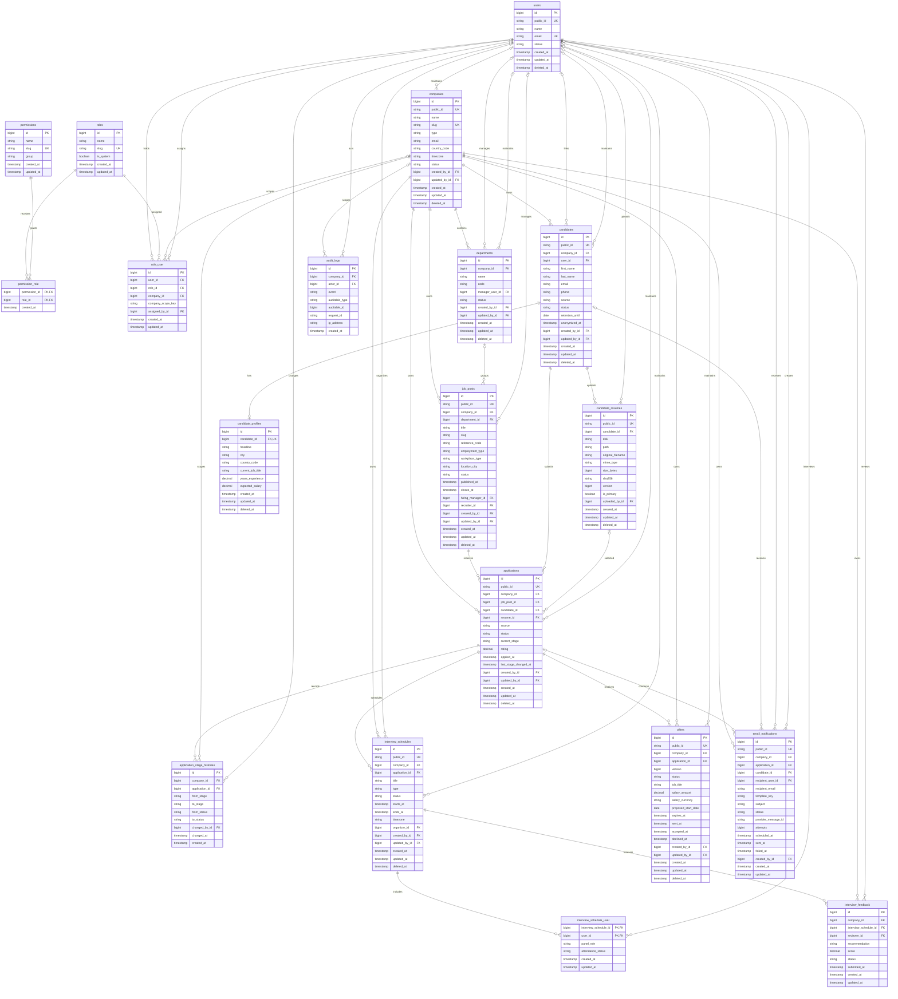

# Applicant Tracking System ERD

## Overview

This entity relationship diagram is derived from [database-design.md](database-design.md), [schema-blueprint.md](schema-blueprint.md), and [migration-plan.md](migration-plan.md). It is a documentation contract for the proposed Laravel 12 and MySQL schema, not a representation of implemented migrations.

## Relationship Notes

- `role_user` resolves the many-to-many relationship between users and roles. Its nullable `company_id` supports company-scoped assignments, while a null company represents platform scope. `company_scope_key` is the planned generated value used to enforce assignment uniqueness when `company_id` is null.
- `permission_role` resolves the many-to-many relationship between roles and permissions.
- A job post may belong to one department, but it always belongs directly to one company. Department and job company ownership must agree.
- A candidate may optionally link to a global `users` identity for a future candidate portal. Candidate records themselves remain company-owned.
- `candidate_profiles.candidate_id` is unique, producing an optional one-to-one profile. A candidate may have many versioned resumes.
- An application joins one job post and one candidate and may reference the resume selected at application time. All referenced records must belong to the same company.
- `application_stage_histories` is append-oriented and records both stage and broad status transitions.
- Interviewers are modeled through `interview_schedule_user`, not a single `interviewer_id`, because an interview may have a panel. `interview_feedback.reviewer_id` identifies the assigned interviewer providing feedback.
- The source schema uses `email_notifications.created_by_id` for the user who initiated a notification and `sent_at` for delivery time. It does not currently define a separate `sent_by_id`.
- Repeated `created_by_id` and `updated_by_id` columns are summarized as `users` maintaining the associated entity. These actor references are nullable so system operations and user removal do not erase business history.
- `audit_logs.auditable_type` and `auditable_id` form a polymorphic-style logical reference. They intentionally have no foreign key to audited business tables, allowing audit evidence to outlive target deletion.

## Cardinality Summary

| Parent | Child | Cardinality |
| --- | --- | --- |
| Users | Roles | Many-to-many through `role_user` |
| Roles | Permissions | Many-to-many through `permission_role` |
| Companies | Departments | One-to-many |
| Companies | Job posts | One-to-many |
| Departments | Job posts | Optional one-to-many |
| Companies | Candidates | One-to-many |
| Candidates | Candidate profiles | One-to-zero-or-one |
| Candidates | Candidate resumes | One-to-many |
| Job posts | Applications | One-to-many |
| Candidates | Applications | One-to-many |
| Applications | Stage histories | One-to-many |
| Applications | Interview schedules | One-to-many |
| Interview schedules | Users | Many-to-many through `interview_schedule_user` |
| Interview schedules | Interview feedback | One-to-many |
| Applications | Offers | One-to-many version history |
| Companies | Email notifications | One-to-many |
| Companies | Audit logs | One-to-many, with company optional for platform events |

## Tenant Boundary Notes

- Companies are the tenant root. Business data should carry `company_id` where practical, including jobs, candidates, applications, stage histories, interviews, feedback, offers, notifications, and company-level audit records.
- Global identities, roles, and permissions are not owned by one company. `role_user` supplies the company context for tenant-level access.
- Foreign keys establish row existence but do not prove that related rows share a company. Future write workflows must use tenant-scoped queries and transactional consistency checks.
- Public ULIDs provide non-sequential external references, but they do not replace tenant authorization or internal primary keys.
- Candidate identity, feedback, salary, offer, and notification data is confidential. Candidate resumes and offer documents must use private storage disks and authorized, short-lived download responses, never public storage paths.

## Workflow Notes

- Workflow statuses and stages remain string-based columns backed by application allowlists or value objects, not MySQL `ENUM` types.
- `applications.status` stores the broad lifecycle outcome, while `applications.current_stage` stores the active hiring-pipeline position.
- Every application stage transition should update the current snapshot and append an `application_stage_histories` record in the same transaction.
- Interview status, feedback submission, offer versioning, and notification delivery each have independent string-based lifecycles.
- Rules such as one primary resume per candidate, one submitted review per interviewer and interview, and one accepted offer per application require transactional enforcement in future Services.

## Implementation Notes for Future Migration Scope

- This file is documentation only. It does not create tables, constraints, models, or application behavior.
- Future migrations should follow the dependency order in [migration-plan.md](migration-plan.md), declare foreign-key delete actions explicitly, and preserve the indexes and uniqueness rules in [schema-blueprint.md](schema-blueprint.md).
- Laravel Form Requests will handle input validation in a later scope.
- Services will handle complex workflow rules, tenant consistency, transactions, and concurrency-sensitive invariants.
- Policies and Gates will enforce tenant and resource access. Role assignments alone are not sufficient authorization.
- Controllers should remain thin and delegate validation, authorization, and business operations to those layers.
- Migration and rollback verification must eventually run against MySQL, especially for generated columns, check constraints, collations, and nullable unique behavior.
